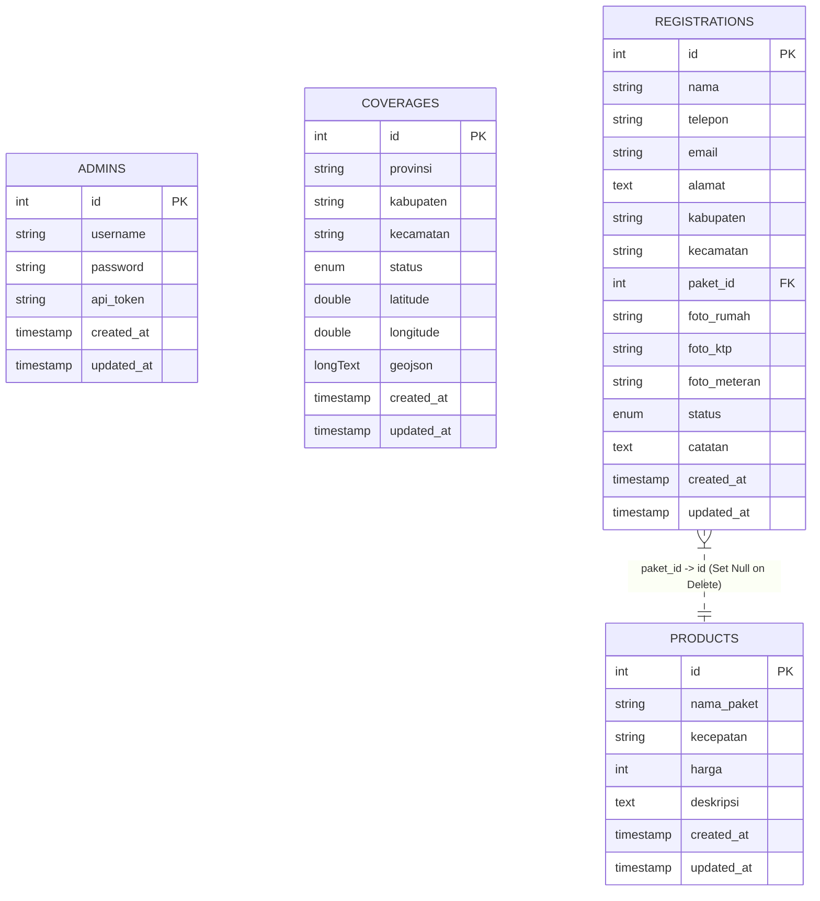
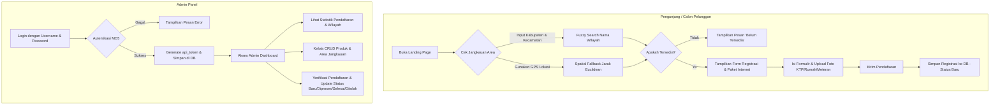

# ISP Management System - MyRepublic Coverage Tracker

[](https://laravel.com/)
[](https://react.dev/)
[](https://vite.dev/)
[](https://www.docker.com/)

Aplikasi Manajemen Layanan ISP (Internet Service Provider) yang dirancang khusus untuk mengelola peta jangkauan wilayah (*coverage area*) layanan MyRepublic, pengecekan ketersediaan jaringan, pendaftaran calon pelanggan baru dengan berkas digital, serta panel kontrol administrator. 

Proyek ini merupakan hasil migrasi dan peningkatan (*upgrade*) dari sistem legacy PHP murni ke arsitektur modern terpisah (*decoupled architecture*): API Backend berbasis **Laravel 5.2** dan Dashboard/Frontend berbasis **React 19 (Vite + Tailwind CSS)**.

---

## 1. Overview (Ikhtisar)

Sistem ini membantu memecahkan tantangan operasional pemasaran ISP di lapangan. Calon pelanggan dapat secara mandiri memeriksa ketersediaan jaringan internet di wilayah mereka menggunakan pencarian nama kecamatan/kabupaten maupun koordinat GPS langsung (*share location*). 

Jika jaringan tersedia, calon pelanggan dapat langsung memilih paket internet, mengisi data diri, dan mengunggah dokumen digital persyaratan (Foto KTP, Foto Rumah, dan Foto Meteran). Semua data pendaftaran ini masuk secara *real-time* ke **Admin Dashboard** untuk diverifikasi dan ditindaklanjuti oleh petugas administrasi.

---

## 2. Fitur Utama & Keunggulan Sistem

Sistem ini dilengkapi dengan berbagai fitur premium dan alur logika cerdas untuk memudahkan pengelolaan:

*   **Peta Interaktif Coverage Area (Leaflet.js)**: Integrasi peta interaktif di sisi klien untuk melihat secara visual sebaran jangkauan wilayah layanan dengan pengelompokan marker status (Tersedia / Belum Tersedia).
*   **Pencarian & Validasi Geografis Cerdas**:
    *   *Fuzzy Text Normalization*: Menghapus kata umum seperti "kecamatan", "kabupaten", "kota", dsb. untuk menghindari kegagalan pencarian akibat perbedaan format penulisan.
    *   *Spatial Fallback (GPS Geolocation)*: Jika pencarian teks kecamatan tidak ditemukan di database, sistem menggunakan koordinat GPS user untuk menghitung jarak terdekat (*Euclidean Distance*) ke wilayah *coverage* terdaftar dalam radius ~15 km secara otomatis.
*   **Otomatisasi Geocoding Wilayah (OpenStreetMap Nominatim API)**: Jika admin mendaftarkan wilayah *coverage* baru tanpa memasukkan koordinat manual, sistem akan otomatis melakukan request asinkron ke OpenStreetMap untuk menarik koordinat pusat (*centroid*) serta batas polygon *GeoJSON* wilayah tersebut.
*   **Pendaftaran Calon Pelanggan Digital**: Mengakomodasi formulir data diri lengkap beserta pengunggahan 3 jenis berkas gambar (Foto Rumah, KTP, dan Meteran) dengan limitasi ukuran 5MB secara aman ke server lokal.
*   **Dashboard Statistik & Grafik (Chart.js)**: Menyajikan data agregat kepada administrator, seperti jumlah pendaftaran baru, perbandingan area terjangkau, serta visualisasi grafik status registrasi.
*   **Keamanan & API Terproteksi**: Autentikasi administrator menggunakan token dinamis (*Bearer Token* / *API Token*) dengan masa aktif yang dikontrol secara ketat melalui middleware kustom.

---

## 3. Struktur Direktori Blueprint (File Tree)

Berikut adalah struktur blueprint folder proyek utama yang mencakup backend Laravel 5.2 dan frontend React 19:

```text
andriyan/
├── docker/                             # Konfigurasi container Docker
│   ├── nginx/
│   │   └── default.conf                # Konfigurasi routing server Nginx
│   └── php/
│       ├── Dockerfile                  # Build image PHP 5.6-fpm + extensions
│       └── php.ini                     # Kustomisasi php.ini lokal
├── docker-compose.yml                  # File orkestrasi Docker multi-container
├── isp/                                # Kode legacy (Pure PHP & DB dump)
│   ├── db_isp.sql                      # SQL database dump untuk inisialisasi DB
│   └── ...                             # File PHP legacy (login, cek_coverage, dsb.)
└── laravel/                            # Direktori Aplikasi Utama (Laravel 5.2)
    ├── app/                            # Logika Inti Aplikasi
    │   ├── Http/
    │   │   ├── Controllers/            # API Controllers
    │   │   │   ├── AuthController.php          # Login, logout, & stats admin
    │   │   │   ├── CoverageController.php      # CRUD & Cek ketersediaan area
    │   │   │   ├── ProductController.php       # CRUD Paket Internet
    │   │   │   └── RegistrationController.php  # CRUD Pendaftaran pelanggan
    │   │   ├── Middleware/             # Request Middlewares
    │   │   │   ├── AdminAuth.php               # Kustomisasi autentikasi token admin
    │   │   │   └── Cors.php                    # Pengaturan Cross-Origin Resource Sharing
    │   │   └── routes.php              # Definisi endpoints API Backend
    │   ├── Admin.php                   # Model Administrator
    │   ├── Coverage.php                # Model Wilayah Jangkauan (Coverage)
    │   ├── Product.php                 # Model Paket Internet (Product)
    │   ├── Registration.php            # Model Pendaftaran Pelanggan
    │   └── User.php                    # Model User bawaan Laravel
    ├── config/                         # File konfigurasi Laravel
    ├── database/
    │   ├── migrations/                 # Migrasi Database Skema
    │   └── seeds/                      # Seeders Data Awal (Admin & Wilayah Lampung)
    ├── frontend/                       # Aplikasi Klien (React JS + Vite)
    │   ├── public/
    │   ├── src/
    │   │   ├── assets/
    │   │   ├── pages/                  # Halaman Utama Aplikasi
    │   │   │   ├── AdminDashboard.jsx  # Control Panel Admin (Manajemen data & chart)
    │   │   │   └── LandingPage.jsx     # Landing page publik (Form check & register)
    │   │   ├── App.css
    │   │   ├── App.jsx                 # Routing hash dan inisialisasi aplikasi
    │   │   ├── index.css               # Styling kustom (Tailwind CSS variables)
    │   │   └── main.jsx
    │   ├── package.json                # Dependensi React
    │   └── vite.config.js              # Konfigurasi build Vite
    ├── public/                         # Public path Laravel (Uploads target)
    │   └── uploads/
    │       └── registrations/          # Target penyimpanan berkas foto pendaftaran
    ├── .env                            # Konfigurasi Environment lokal
    ├── .env.example
    └── composer.json                   # Dependensi Package Composer PHP
```

---

## 4. Arsitektur Database (Skema Relasi)

Database relasional ini menggunakan **MariaDB / MySQL**. Terdiri dari 4 tabel utama yang terintegrasi.



### Detail Struktur Kolom Tabel

1.  **`admins`**: Menyimpan kredensial admin. Kata sandi terenkripsi MD5 untuk kompatibilitas data legacy.
2.  **`products`**: Menyimpan daftar pilihan paket internet (kecepatan Mbps, harga rupiah, deskripsi).
3.  **`coverages`**: Menyimpan data daerah cakupan. Menyimpan data spasial berupa koordinat lintang (`latitude`), bujur (`longitude`), dan batas koordinat polygon wilayah (`geojson` bertipe longText).
4.  **`registrations`**: Menyimpan entri pendaftaran pelanggan baru dengan status default `'Baru'`. Relasi ke tabel `products` melalui `paket_id` bersifat opsional (`nullable`).

---

## 5. Alur Kerja Utama Sistem (System Flow)

Sistem ini membagi alur kerja menjadi dua sisi utama: **Calon Pelanggan** dan **Administrator**.



### Penjelasan Alur Kerja

#### A. Alur Registrasi Pelanggan Baru:
1.  Pengunjung membuka halaman web utama dan melakukan pengecekan cakupan layanan.
2.  Setelah memasukkan nama kabupaten dan kecamatan, sistem akan mengecek statusnya di tabel `coverages`.
3.  Jika status terdaftar sebagai **Tersedia**, formulir pendaftaran dan pilihan paket internet akan terbuka.
4.  Pengunjung mengisi formulir dan mengunggah foto KTP, rumah, serta meteran.
5.  Data dikirim melalui API endpoint `POST /api/registrations`. File gambar disimpan ke folder `public/uploads/registrations/` dan entri database dibuat dengan status default `'Baru'`.

#### B. Alur Manajemen Admin:
1.  Admin mengakses halaman dashboard admin (diakses via hash route `#admin`).
2.  Admin melakukan login. Backend memvalidasi password menggunakan hashing MD5. Jika cocok, sistem men-generate string acak 60 karakter sebagai `api_token` dan mengirimkannya kembali ke browser.
3.  Browser menyimpan token tersebut di `localStorage` dan mengirimkannya pada header `Authorization: Bearer <token>` untuk request data selanjutnya.
4.  Admin dapat mengelola data paket internet (CRUD), data coverage area (CRUD), serta meninjau semua pengajuan registrasi (memperbarui status registrasi dan menambahkan catatan tindak lanjut).

---

## 6. Validasi & Logika Teknis Khusus

Berikut adalah beberapa implementasi logika teknis khusus yang diterapkan dalam backend sistem:

### 1. Normalisasi Teks Pencarian Area (Fuzzy Query)
Pada berkas [CoverageController.php](file:///Users/aaaa/Documents/Desain/Client/andriyan/laravel/app/Http/Controllers/CoverageController.php#L186-L193), query pencarian dibersihkan menggunakan Regex untuk menghapus prefiks administratif agar pencarian menjadi lebih fleksibel:
```php
$kabClean = preg_replace('/^(kabupaten|kota|kab\.|kotamadya)\s+/i', '', $kab);
$kecClean = preg_replace('/^(kecamatan|kec\.)\s+/i', '', $kec);

$coverage = Coverage::where('kabupaten', 'LIKE', '%' . $kabClean . '%')
                    ->where('kecamatan', 'LIKE', '%' . $kecClean . '%')
                    ->first();
```

### 2. Spatial Fallback (Pencarian Radius GPS Terdekat)
Jika pencarian berdasarkan teks tidak membuahkan hasil, namun perangkat klien melampirkan koordinat latitude dan longitude (GPS), sistem akan menghitung jarak spasial terdekat menggunakan perhitungan Euclidean:
```php
$dist = sqrt(pow($cov->latitude - $lat, 2) + pow($cov->longitude - $lon, 2));
```
Jika wilayah coverage terdekat berada di bawah rentang toleransi derajat `0.15` (setara kurang lebih $\approx 15 \text{ km}$ dari pusat jangkauan), sistem akan menyimpulkan status coverage berdasarkan titik terdekat tersebut.

### 3. Integrasi OSM Nominatim API untuk Geocoding Otomatis
Saat menambahkan atau memperbarui area coverage tanpa melampirkan koordinat secara manual, backend akan melakukan request HTTP CURL ke Nominatim API milik OpenStreetMap untuk menarik koordinat pusat dan data batas spasial (GeoJSON) kecamatan tersebut:
```php
$query = "Kecamatan " . $kecamatan . ", " . $kabupaten . ", " . $provinsi . ", Indonesia";
$url = "https://nominatim.openstreetmap.org/search?q=" . urlencode($query) . "&format=json&polygon_geojson=1&limit=1";
```
Request ini dilengkapi dengan parameter `User-Agent` khusus sesuai kebijakan penggunaan Nominatim API.

### 4. MD5 Password Hashing & Token-Based Authentication
Sandi admin diverifikasi menggunakan fungsi bawaan `md5($password)` agar selaras dengan data legacy SQL yang diimpor. Sesi dilindungi dengan mencocokkan bearer token pada database via Middleware [AdminAuth.php](file:///Users/aaaa/Documents/Desain/Client/andriyan/laravel/app/Http/Middleware/AdminAuth.php):
```php
$token = $request->header('Authorization');
// Memotong string 'Bearer '
$admin = Admin::where('api_token', $token)->first();
```

---

## 7. Dependensi Proyek (Dependencies)

### Backend (Laravel 5.2)
*   **PHP**: `>= 5.5.9` (direkomendasikan PHP 5.6 atau PHP 7.0)
*   **Laravel Framework**: `5.2.*`
*   **Faker**: `~1.4` (Development)
*   **PHP Extensions**: `pdo_mysql`, `gd`, `mcrypt`, `zip`, `mysqli`

### Frontend (React 19)
*   **React**: `^19.2.6`
*   **Vite**: `^8.0.12`
*   **Leaflet & React Leaflet**: `^1.9.4` & `^5.0.0` (Visualisasi peta interaktif)
*   **Chart.js & React-Chartjs-2**: `^4.5.1` & `^5.3.1` (Visualisasi grafik statistik dashboard)
*   **Lucide React**: `^1.21.0` (Kumpulan ikon SVG modern)

---

## 8. Panduan Instalasi & Menjalankan Proyek (Setup & Run)

Pilih salah satu dari dua metode di bawah ini untuk menjalankan aplikasi di komputer lokal Anda.

---

### METODE A: Menggunakan Docker (Direkomendasikan & Instan)

Metode ini paling mudah karena Anda tidak perlu menginstal PHP 5.6 atau Node secara lokal. Docker akan menyiapkan kontainer yang terisolasi.

#### Prasyarat:
*   [Docker Desktop](https://www.docker.com/products/docker-desktop/) terinstal dan berjalan di komputer Anda.

#### Langkah-langkah:

1.  **Jalankan Docker Compose**:
    Buka terminal di direktori root proyek (`andriyan/`) lalu jalankan perintah berikut:
    ```bash
    docker compose up --build -d
    ```
    Perintah ini akan membangun kontainer backend PHP 5.6-fpm, web server Nginx, database MariaDB 10.4, dan frontend Node.js 20.

2.  **Inisialisasi Database Otomatis**:
    Saat kontainer MariaDB pertama kali dibuat, Docker akan otomatis mengeksekusi dump SQL database legacy yang berada di [db_isp.sql](file:///Users/aaaa/Documents/Desain/Client/andriyan/isp/db_isp.sql) ke dalam database `db_isp`.

3.  **Salin Konfigurasi `.env` Laravel**:
    Pastikan file `.env` di dalam folder `laravel/` sudah terbuat. Jika belum ada, salin file contoh:
    ```bash
    cp laravel/.env.example laravel/.env
    ```
    Konfigurasi database di dalam `.env` harus mengarah ke kontainer Docker:
    ```env
    DB_CONNECTION=mysql
    DB_HOST=db
    DB_PORT=3306
    DB_DATABASE=db_isp
    DB_USERNAME=root
    DB_PASSWORD=rootpassword
    ```

4.  **Akses Aplikasi**:
    *   **Landing Page (React Frontend)**: [http://localhost:5173](http://localhost:5173)
    *   **Admin Dashboard**: [http://localhost:5173/#admin](http://localhost:5173/#admin)
    *   **Backend API Endpoint**: [http://localhost:8001](http://localhost:8001)

---

### METODE B: Instalasi Manual (Tanpa Docker)

Jika Anda ingin menjalankan aplikasi langsung pada sistem operasi Anda, ikuti petunjuk manual berikut:

#### Prasyarat:
*   **PHP**: Versi `5.6` s/d `7.0` terpasang di sistem.
*   **Composer**: Versi `2.2.x` (LTS terakhir yang mendukung PHP 5.6).
*   **Node.js**: Versi `>= 18.0`.
*   **MySQL / MariaDB**: Server database aktif secara lokal.

#### Langkah-langkah Backend (Laravel):

1.  Buka terminal baru dan masuk ke folder `laravel/`:
    ```bash
    cd laravel
    ```
2.  Salin file konfigurasi environment:
    ```bash
    cp .env.example .env
    ```
3.  Sesuaikan pengaturan database Anda di dalam file `.env` (isi `DB_HOST`, `DB_PORT`, `DB_DATABASE`, `DB_USERNAME`, `DB_PASSWORD`).
4.  Instal dependensi composer:
    ```bash
    composer install
    ```
5.  Generate application key:
    ```bash
    php artisan key:generate
    ```
6.  Buat database baru bernama `db_isp` di MySQL server Anda, lalu jalankan migrasi dan seeder untuk menginisialisasi tabel serta data bawaan:
    ```bash
    php artisan migrate --seed
    ```
    > [!TIP]
    > Secara opsional, Anda juga dapat mengimpor data dump SQL secara langsung ke server MySQL lokal menggunakan file [db_isp.sql](file:///Users/aaaa/Documents/Desain/Client/andriyan/isp/db_isp.sql).
7.  Jalankan server lokal Laravel:
    ```bash
    php artisan serve --port=8001
    ```

#### Langkah-langkah Frontend (React JS):

1.  Buka terminal baru dan arahkan ke folder `laravel/frontend/`:
    ```bash
    cd laravel/frontend
    ```
2.  Instal seluruh modul node yang dibutuhkan:
    ```bash
    npm install
    ```
3.  Buat atau pastikan file `.env` di dalam folder ini berisi konfigurasi URL API backend:
    ```env
    VITE_API_URL=http://localhost:8001
    ```
4.  Jalankan server development Vite:
    ```bash
    npm run dev
    ```
5.  Buka browser Anda dan akses aplikasi di [http://localhost:5173](http://localhost:5173).

---

## 9. Kredensial Akun Bawaan (Default Account)

Gunakan akun administrator bawaan di bawah ini untuk masuk ke control panel admin di halaman [http://localhost:5173/#admin](http://localhost:5173/#admin):

*   **Username**: `admin`
*   **Password**: `admin123`

> [!WARNING]
> Akun ini digenerate secara otomatis melalui seeder database ([DatabaseSeeder.php](file:///Users/aaaa/Documents/Desain/Client/andriyan/laravel/database/seeds/DatabaseSeeder.php)). Sangat disarankan untuk mengubah password admin pada produksi demi keamanan sistem.

---

## 10. Ringkasan Tech Stack (Teknologi yang Digunakan)

*   **Core Backend**: [Laravel 5.2 Framework](https://laravel.com/) (PHP)
*   **Core Frontend**: [React JS 19](https://react.dev/) & [Vite JS 8](https://vite.dev/) (Single Page Application)
*   **Web Server**: [Nginx Alpine](https://nginx.org/) (Reverse Proxy & Static File Serving)
*   **Database**: [MariaDB 10.4](https://mariadb.org/) / [MySQL](https://www.mysql.com/)
*   **Styling & UI**: [Tailwind CSS Utility-First Framework](https://tailwindcss.com/) & Vanilla CSS Variables
*   **Maps & Geolocation**: [Leaflet.js](https://leafletjs.com/) & [React Leaflet v5](https://react-leaflet.js.org/)
*   **Third-Party API**: [OpenStreetMap Nominatim Geocoding API](https://nominatim.org/)
*   **Chart Engine**: [Chart.js](https://www.chartjs.org/) & [React-Chartjs-2](https://react-chartjs-2.js.org/)
*   **Icons Library**: [Lucide React Icons](https://lucide.dev/)
*   **Containerization**: [Docker](https://www.docker.com/) & [Docker Compose](https://docs.docker.com/compose/)
