# HASIL PENELITIAN DAN PEMBAHASAN

## 1. Desain Sistem
Desain sistem digunakan untuk menggambarkan bagaimana sistem berjalan, berinteraksi dengan pengguna, serta memetakan alur proses yang berjalan dalam sistem. Desain sistem ini didefinisikan menggunakan Use Case Diagram dan Activity Diagram.

### a. Use Case Diagram
Use Case Diagram menggambarkan interaksi antara pengguna (*actor*) dengan sistem yang diusulkan. Sistem ini memiliki 2 (dua) *actor*, yaitu **Calon Pelanggan** (pengguna umum) dan **Administrator** (pengelola sistem).

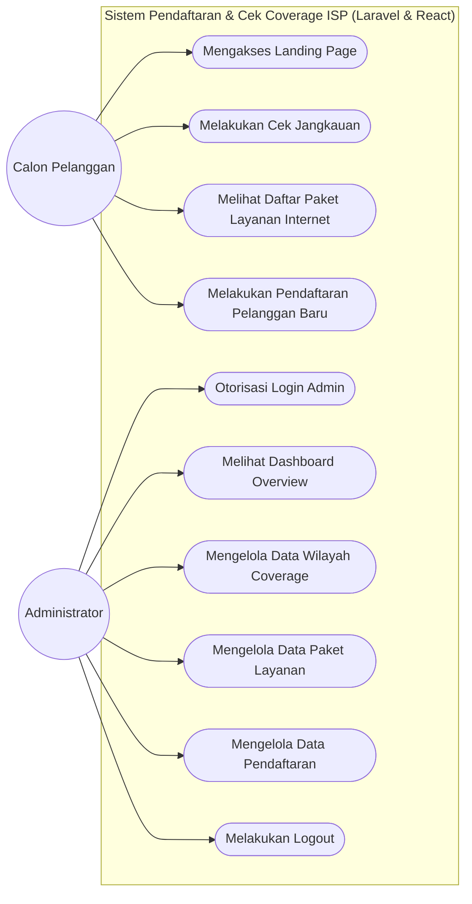

---

### b. Activity Diagram per Role User
Activity Diagram menggambarkan alur aktivitas sistem terstruktur untuk masing-masing *role* pengguna.

#### 1) Activity Diagram Calon Pelanggan
Menggambarkan alur aktivitas ketika calon pelanggan melakukan cek lokasi jangkauan dan mendaftar paket layanan.

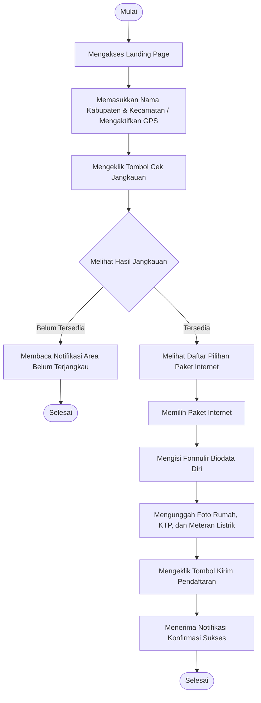

#### 2) Activity Diagram Administrator
Menggambarkan alur kerja administrator dalam memantau statistik, mengelola data master, serta memproses pendaftaran pelanggan baru.

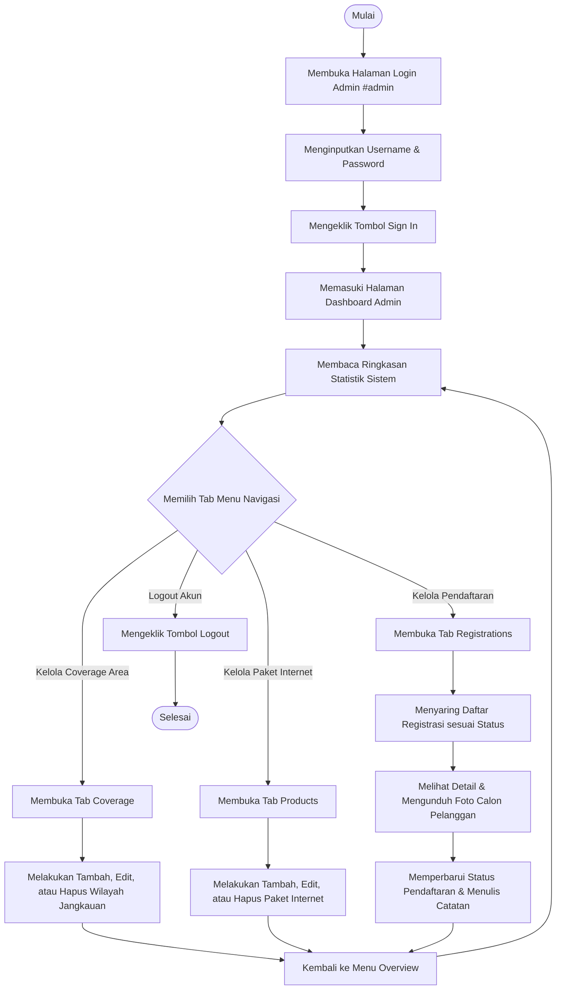

---

## 2. Desain Prosedur Sistem yang Diusulkan

### a. Desain Database
Desain database ini mengacu pada struktur file migrasi database Laravel yang terpasang pada sistem.

#### 1) ERD Chen (Entity-Relationship Diagram Chen)
ERD model Chen menggambarkan hubungan logis entitas berserta atribut-atributnya secara mendalam menggunakan flowchart grafis.

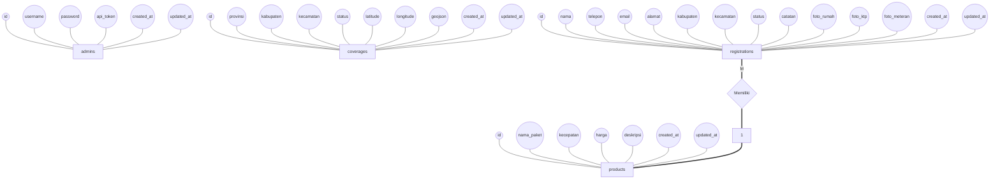

---

#### 2) Tabel Tiap Role dan Model

##### (1) Tabel Admins
Tabel `admins` diperlukan bagi pengguna administrator untuk mengakses dashboard admin website dan mengautentikasi setiap permintaan API yang terlindungi.
*   **Nama Tabel**: admins
*   **Primary Key**: id
*   **Jumlah Field**: 6

| Nama Field | Tipe Data | Ukuran | Atribut / Keterangan |
| :--- | :--- | :--- | :--- |
| **id** | INT | Auto-increment | Primary Key, ID unik administrator |
| **username** | VARCHAR | 50 | Unique, Nama akun admin untuk login |
| **password** | VARCHAR | 255 | MD5 hashed password untuk otorisasi login |
| **api_token** | VARCHAR | 100 | Nullable, Token sesi admin yang aktif |
| **created_at** | TIMESTAMP | - | Tanggal & waktu pembuatan data admin |
| **updated_at** | TIMESTAMP | - | Tanggal & waktu update data admin |

---

##### (2) Tabel Products
Tabel `products` digunakan untuk menyimpan katalog paket internet yang ditawarkan oleh ISP kepada calon pelanggan.
*   **Nama Tabel**: products
*   **Primary Key**: id
*   **Jumlah Field**: 7

| Nama Field | Tipe Data | Ukuran | Atribut / Keterangan |
| :--- | :--- | :--- | :--- |
| **id** | INT | Auto-increment | Primary Key, ID unik paket produk |
| **nama_paket** | VARCHAR | 100 | Nama paket internet (contoh: ISP-Lite, ISP-Pro) |
| **kecepatan** | VARCHAR | 50 | Kecepatan bandwidth (contoh: 20 Mbps, 50 Mbps) |
| **harga** | INT | - | Nominal tarif langganan bulanan |
| **deskripsi** | TEXT | - | Nullable, Detail informasi benefit paket |
| **created_at** | TIMESTAMP | - | Tanggal & waktu paket ditambahkan |
| **updated_at** | TIMESTAMP | - | Tanggal & waktu paket diperbarui |

---

##### (3) Tabel Coverages
Tabel `coverages` menyimpan daftar wilayah administratif jangkauan fiber optik yang mendukung operasional instalasi internet ISP.
*   **Nama Tabel**: coverages
*   **Primary Key**: id
*   **Jumlah Field**: 10

| Nama Field | Tipe Data | Ukuran | Atribut / Keterangan |
| :--- | :--- | :--- | :--- |
| **id** | INT | Auto-increment | Primary Key, ID unik wilayah jangkauan |
| **provinsi** | VARCHAR | 100 | Nama provinsi (default: 'Lampung') |
| **kabupaten** | VARCHAR | 100 | Nama kabupaten / kota wilayah coverage |
| **kecamatan** | VARCHAR | 100 | Nama kecamatan wilayah coverage |
| **status** | ENUM | - | Status ketersediaan jaringan ('Tersedia', 'Belum Tersedia') |
| **latitude** | DOUBLE | - | Nullable, Titik koordinat garis lintang pusat wilayah |
| **longitude** | DOUBLE | - | Nullable, Titik koordinat garis bujur pusat wilayah |
| **geojson** | LONGTEXT | - | Nullable, Data batas poligon batas administratif wilayah |
| **created_at** | TIMESTAMP | - | Tanggal data wilayah coverage dibuat |
| **updated_at** | TIMESTAMP | - | Tanggal data wilayah coverage diperbarui |

---

##### (4) Tabel Registrations
Tabel `registrations` mencatat formulir pengisian data calon pelanggan baru yang terbukti masuk dalam cakupan wilayah coverage ISP.
*   **Nama Tabel**: registrations
*   **Primary Key**: id
*   **Foreign Key**: paket_id (relasi ke tabel `products`)
*   **Jumlah Field**: 15

| Nama Field | Tipe Data | Ukuran | Atribut / Keterangan |
| :--- | :--- | :--- | :--- |
| **id** | INT | Auto-increment | Primary Key, ID unik pendaftaran calon pelanggan |
| **nama** | VARCHAR | 100 | Nama lengkap calon pelanggan |
| **telepon** | VARCHAR | 20 | Nomor handphone/telepon calon pelanggan |
| **email** | VARCHAR | 100 | Alamat email calon pelanggan |
| **alamat** | TEXT | - | Alamat instalasi lengkap rumah calon pelanggan |
| **kabupaten** | VARCHAR | 100 | Nama kabupaten lokasi instalasi |
| **kecamatan** | VARCHAR | 100 | Nama kecamatan lokasi instalasi |
| **paket_id** | INT | - | Foreign Key, Nullable, Menghubungkan paket pilihan |
| **foto_rumah** | VARCHAR | 255 | Nullable, Path unggahan foto rumah depan calon pelanggan |
| **foto_ktp** | VARCHAR | 255 | Nullable, Path unggahan foto Kartu Tanda Penduduk |
| **foto_meteran** | VARCHAR | 255 | Nullable, Path unggahan foto meteran listrik PLN |
| **status** | ENUM | - | Status proses ('Baru', 'Diproses', 'Selesai', 'Ditolak') |
| **catatan** | TEXT | - | Nullable, Catatan tindak lanjut tim admin/teknisi |
| **created_at** | TIMESTAMP | - | Tanggal & waktu pendaftaran masuk |
| **updated_at** | TIMESTAMP | - | Tanggal & waktu pendaftaran diperbarui statusnya |

---

#### 3) Relasi Tabel
Relasi tabel mendefinisikan hubungan antarentitas data pada sistem:
1.  **Tabel `products` dengan `registrations` (1:M)**:
    Satu paket internet (`products`) dapat dipilih oleh banyak calon pelanggan (`registrations`). Hubungan ini diwakili oleh kunci asing `registrations.paket_id` yang mereferensikan kunci utama `products.id`. Pada skema migrasi Laravel, relasi didefinisikan dengan aksi `onDelete('set null')` guna mencegah terhapusnya data registrasi pelanggan apabila paket produk dihapus oleh admin.
2.  **Tabel `admins`, `coverages`, dan `registrations`**:
    Tabel `admins` berfungsi mandiri untuk otorisasi akses API admin, sedangkan data `coverages` digunakan sebagai sistem referensi pembatasan pendaftaran di landing page (hanya pelanggan di area berstatus "Tersedia" yang dapat melanjutkan pengiriman data registrasi ke tabel `registrations`).

---

### b. Desain Interface

#### 1) Rancangan Form Login Admin
Form login digunakan untuk otentikasi administrator agar dapat mengelola kontrol dashboard admin.

```
+-------------------------------------------------------------+
|                        ADMIN SIGN IN                        |
|                                                             |
|   Username:                                                 |
|   [                                                     ]   |
|                                                             |
|   Password:                                                 |
|   [ *********************************** ]                   |
|                                                             |
|   [                     SIGN IN                         ]   |
+-------------------------------------------------------------+
```
*Gambar 9. Rancangan Form login (Sumber: Penulis, 2026)*

##### Tabel 12. Rancangan Form Halaman Login Admin
| Elemen / Tombol | Fungsi |
| :--- | :--- |
| **Username** | Input field untuk memasukkan username akun administrator |
| **Password** | Input field untuk memasukkan password otorisasi login admin |
| **Tombol Sign In** | Mengirimkan data login ke backend API `/api/login` untuk divalidasi |

#### 2) DST (Dan Seterusnya - Rancangan Interface Lain)

##### (1) Rancangan Landing Page & Cek Coverage
Landing page merupakan halaman utama calon pelanggan untuk mengecek ketersediaan jaringan ISP di wilayahnya.
*   **Fitur Utama**: Peta interaktif Leaflet, formulir pencarian manual (Kabupaten & Kecamatan), dan daftar paket internet.

##### (2) Rancangan Formulir Registrasi Pelanggan Baru (Pop-up Modal)
Formulir pendaftaran pelanggan baru muncul secara dinamis sebagai modal ketika hasil cek coverage calon pelanggan berstatus "Tersedia".
*   **Input Data**: Nama Lengkap, Nomor Telepon, Alamat Email, Alamat Lengkap, Pilihan Paket, Unggah File Foto Rumah, Unggah File Foto KTP, dan Unggah File Foto Meteran Listrik.

##### (3) Rancangan Dashboard Overview Admin
Halaman dashboard utama untuk menampilkan panel grafik dan metrik performa sistem.
*   **Komponen**: Widget statistik jumlah paket, jumlah wilayah, wilayah aktif jangkauan, total registrasi, registrasi baru, dan grafik pendaftaran bulanan.

---

## 4. Implementasi Sistem

### 1) Halaman Form Login Admin
Halaman ini adalah tampilan nyata dari panel form login yang diimplementasikan menggunakan React.js dan didekorasi dengan CSS modern untuk melayani otentikasi login admin secara responsif.

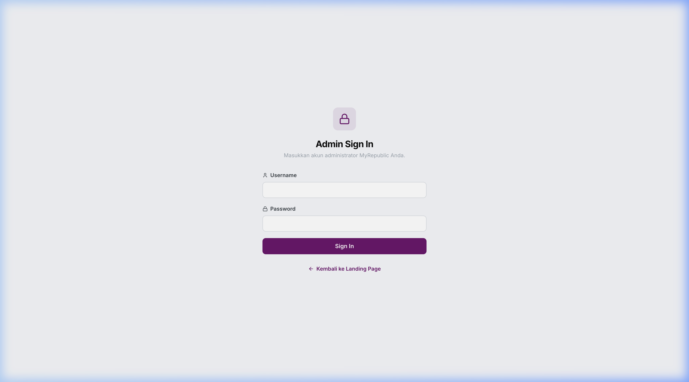
*Gambar 14. Halaman Form login (Sumber: Penulis, 2026)*

##### Tabel 17. Halaman Form Login Admin Terimplementasi
| Elemen / Tombol | Fungsi |
| :--- | :--- |
| **Username Input** | Elemen input bertipe teks dengan `value={loginUser}` untuk penulisan username |
| **Password Input** | Elemen input bertipe password dengan `value={loginPass}` demi keamanan input sandi |
| **Tombol Sign In** | Tombol submit yang mengeksekusi metode `handleLogin` via POST request ke backend |
| **Notifikasi Error** | Menampilkan respons kesalahan validasi/koneksi jika status HTTP gagal |

---

### 2) DST (Dan Seterusnya - Implementasi Halaman Lain)

##### (1) Halaman Landing Page & Cek Coverage Jangkauan
Calon pelanggan melihat peta wilayah jangkauan yang digambar secara interaktif menggunakan Leaflet Map. Ketika mengklik titik lokasi di peta atau menginput kecamatan dan kabupaten secara manual, sistem memanggil endpoint `/api/coverage/check`. Jika status adalah "Tersedia", tombol pendaftaran akan aktif.

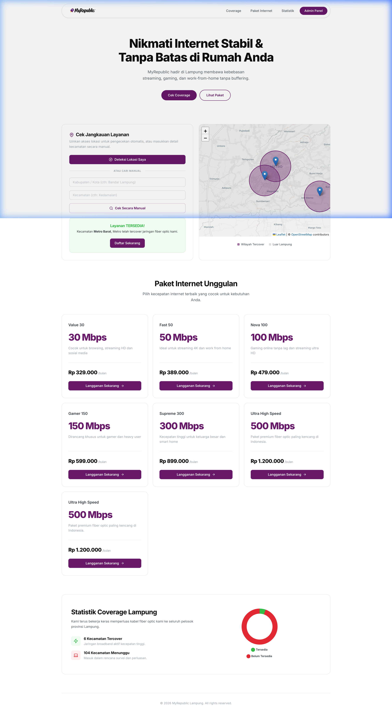
*Gambar 15. Halaman Landing Page (Sumber: Penulis, 2026)*

##### Tabel 18. Halaman Landing Page & Cek Coverage Terimplementasi
| Elemen / Tombol | Fungsi |
| :--- | :--- |
| **Peta Interaktif (Leaflet)** | Menampilkan visualisasi area cakupan jangkauan jaringan fiber optik secara geografis |
| **Input Kabupaten** | Field input teks untuk menuliskan nama kabupaten/kota secara manual |
| **Input Kecamatan** | Field input teks untuk menuliskan nama kecamatan secara manual |
| **Tombol Gunakan Lokasi Saya** | Menggunakan fitur GPS perangkat untuk mendeteksi koordinat koordinat (latitude & longitude) secara otomatis |
| **Tombol Cek Jangkauan** | Mengirimkan data wilayah ke backend API `/api/coverage/check` untuk memverifikasi ketersediaan jaringan |

---

##### (2) Formulir Pendaftaran & Upload Attachment Pelanggan Baru
Calon pelanggan yang areanya terjangkau dapat mengisi biodata. Field upload berkas (`foto_rumah`, `foto_ktp`, `foto_meteran`) menggunakan input file HTML bertipe multipart yang kemudian diunggah ke server dan disimpan ke direktori `public/uploads/registrations/`.

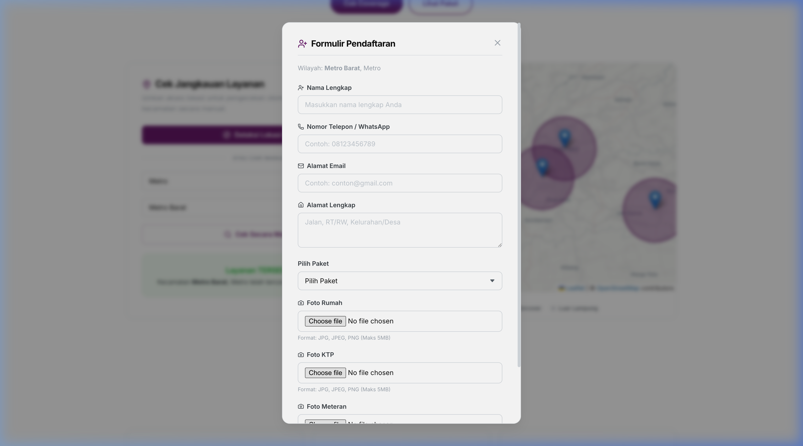
*Gambar 16. Formulir Pendaftaran Pelanggan Baru (Sumber: Penulis, 2026)*

##### Tabel 19. Formulir Pendaftaran Pelanggan Baru Terimplementasi
| Elemen / Tombol | Fungsi |
| :--- | :--- |
| **Nama Lengkap** | Field input teks untuk memasukkan nama lengkap calon pelanggan |
| **No. Telepon** | Field input teks untuk memasukkan nomor telepon/WhatsApp aktif |
| **Email** | Field input teks bertipe email untuk alamat surat elektronik aktif |
| **Alamat Lengkap** | Field textarea untuk menginputkan alamat lengkap pemasangan |
| **Pilihan Paket** | Dropdown berisi paket internet pilihan yang dipilih calon pelanggan |
| **Pilih File Foto Rumah** | Tombol upload gambar untuk melampirkan foto bagian depan rumah tinggal |
| **Pilih File Foto KTP** | Tombol upload gambar untuk melampirkan foto Kartu Tanda Penduduk |
| **Pilih File Foto Meteran** | Tombol upload gambar untuk melampirkan foto meteran listrik PLN |
| **Tombol Kirim Pendaftaran** | Melakukan submit formulir pendaftaran pelanggan baru beserta berkas gambar ke backend API |

---

##### (3) Halaman Dashboard Admin Overview
Setelah admin berhasil login, dashboard akan memuat overview statistik agregasi data yang bersumber dari API `/api/stats` dengan representasi grafis grafik pendaftaran.

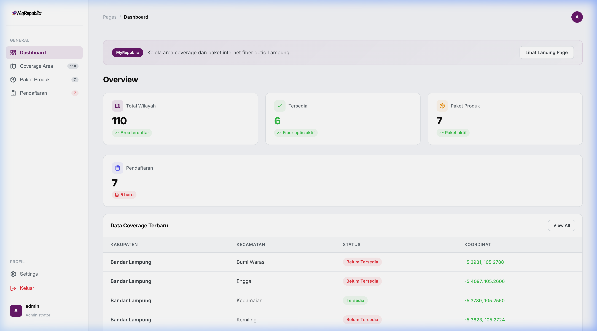
*Gambar 17. Dashboard Admin Overview (Sumber: Penulis, 2026)*

##### Tabel 20. Halaman Dashboard Admin Overview Terimplementasi
| Elemen / Tombol | Fungsi |
| :--- | :--- |
| **Card Total Paket** | Menampilkan total jumlah paket produk internet yang terdaftar di database |
| **Card Total Wilayah** | Menampilkan total jumlah wilayah coverage yang terdata di sistem |
| **Card Wilayah Tersedia** | Menampilkan jumlah wilayah coverage yang berstatus aktif/Tersedia |
| **Card Total Registrasi** | Menampilkan total keseluruhan pengajuan pendaftaran pelanggan masuk |
| **Card Registrasi Baru** | Menampilkan jumlah pendaftaran calon pelanggan yang masih berstatus baru (belum diproses) |
| **Grafik Registrasi Bulanan** | Representasi grafis visual fluktuasi jumlah pendaftaran pelanggan per bulan |

---

##### (4) Halaman CRUD Kelola Paket Internet (Products)
Halaman ini menyajikan tabel kelola paket produk internet dengan antarmuka untuk menambah paket baru, mengubah tarif/kecepatan paket, dan menghapus paket yang tidak lagi aktif.

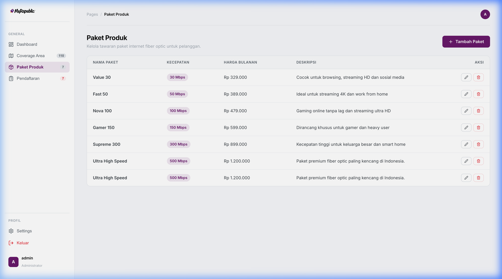
*Gambar 18. Halaman CRUD Kelola Paket Internet (Sumber: Penulis, 2026)*

##### Tabel 21. Halaman CRUD Kelola Paket Internet Terimplementasi
| Elemen / Tombol | Fungsi |
| :--- | :--- |
| **Tombol Tambah Paket** | Membuka modal pop-up formulir penambahan paket internet baru |
| **Input Nama Paket** | Field input teks nama paket baru (contoh: Fast 50) |
| **Input Kecepatan** | Field input teks kecepatan bandwidth paket baru (contoh: 50 Mbps) |
| **Input Harga** | Field input angka nominal biaya bulanan paket baru |
| **Input Deskripsi** | Field textarea keterangan benefit paket baru |
| **Tombol Edit (Ikon Pensil)** | Membuka modal formulir pengeditan data paket terpilih |
| **Tombol Hapus (Ikon Sampah)** | Menghapus data paket internet terpilih secara permanen dari database |
| **Tombol Simpan** | Menyimpan penambahan / perubahan data paket internet ke database |

---

##### (5) Halaman CRUD Kelola Wilayah Coverage
Halaman admin untuk mendaftarkan wilayah coverage. Sistem terintegrasi dengan Nominatim OpenStreetMap API untuk mencari koordinat geografis (Latitude, Longitude) dan GeoJSON batas administrasi secara otomatis berdasarkan nama kecamatan dan kabupaten.

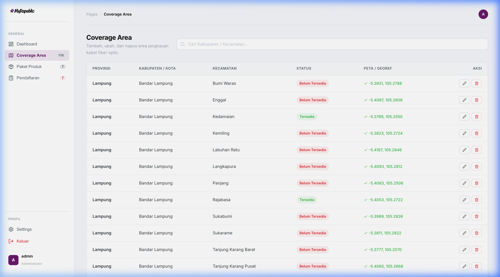
*Gambar 19. Halaman CRUD Kelola Wilayah Coverage (Sumber: Penulis, 2026)*

##### Tabel 22. Halaman CRUD Kelola Wilayah Coverage Terimplementasi
| Elemen / Tombol | Fungsi |
| :--- | :--- |
| **Tombol Tambah Wilayah** | Membuka modal pop-up formulir penambahan area coverage baru |
| **Input Provinsi** | Field input teks nama provinsi (default Lampung) |
| **Input Kabupaten** | Field input teks nama kabupaten / kota |
| **Input Kecamatan** | Field input teks nama kecamatan |
| **Dropdown Status** | Pilihan status ketersediaan area jangkauan ('Tersedia', 'Belum Tersedia') |
| **Input Latitude & Longitude** | Koordinat geografis manual (jika dikosongkan, sistem mengambil otomatis via API Nominatim) |
| **Tombol Edit (Ikon Pensil)** | Membuka modal formulir pengeditan wilayah coverage terpilih |
| **Tombol Hapus (Ikon Sampah)** | Menghapus data wilayah coverage terpilih secara permanen dari database |
| **Tombol Simpan** | Mengirimkan data wilayah, memicu integrasi koordinat OpenStreetMap, dan menyimpannya |

---

##### (6) Halaman Manajemen Registrasi Pelanggan Baru
Halaman ini menampilkan seluruh daftar pengajuan pasang baru dari calon pelanggan. Admin dapat menyaring data berdasarkan status (Baru, Diproses, Selesai, Ditolak), mengunduh dokumen lampiran foto secara langsung, menulis catatan verifikasi, serta mengubah status pendaftaran.

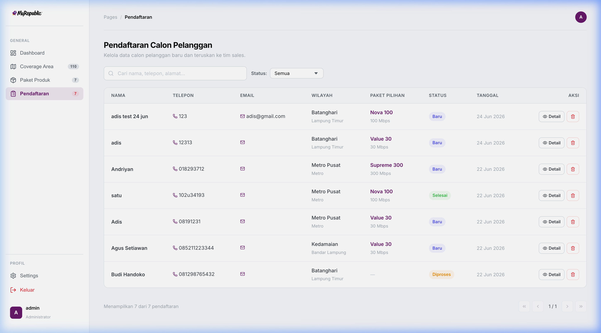
*Gambar 20. Halaman Manajemen Registrasi Pelanggan (Sumber: Penulis, 2026)*

##### Tabel 23. Halaman Manajemen Registrasi Pelanggan Terimplementasi
| Elemen / Tombol | Fungsi |
| :--- | :--- |
| **Dropdown Filter Status** | Menyaring baris data pendaftaran pelanggan berdasarkan status tertentu |
| **Tombol Detail (Ikon Eye)** | Membuka rincian lengkap biodata calon pelanggan |
| **Link Lampiran Foto** | Membuka / mengunduh file foto rumah, foto KTP, atau foto meteran yang diunggah pelanggan |
| **Dropdown Status Pendaftaran** | Mengubah status progres pendaftaran ('Baru', 'Diproses', 'Selesai', 'Ditolak') |
| **Input Catatan Admin** | Textarea untuk menambahkan catatan/keterangan tindak lanjut dari admin/teknisi |
| **Tombol Simpan Perubahan** | Menyimpan pembaruan status dan catatan registrasi pelanggan ke database |
| **Tombol Hapus (Ikon Sampah)** | Menghapus pengajuan pendaftaran pelanggan secara permanen dari database |

---

## 5. Uji Coba Sistem (Testing)

Testing digunakan untuk melihat dan mengevaluasi hasil fungsionalitas dari sistem yang sudah dibangun. Penulis melakukan pengujian dengan metode **Black Box Testing** yang menitikberatkan pada kesesuaian masukan (input) dan keluaran (output) sistem tanpa harus meninjau struktur internal kode program secara langsung.

*   **Berhasil**: Jika program yang diuji berjalan lancar dan memberikan hasil keluaran sesuai dengan skenario harapan.
*   **Error / Gagal**: Jika program yang diuji tidak berjalan, memunculkan kesalahan validasi yang tidak ditangani, atau menghasilkan data yang tidak sesuai harapan.

### a. Testing Form Login Admin
Pengujian fungsionalitas masuk sistem oleh pengguna administrator.
*(Sumber: Penulis, 2026)*

##### Tabel 26. Testing Form Login Admin
| No | Skenario Pengujian | Test Case | Hasil yang Diharapkan | Hasil Pengujian | Kesimpulan |
| :--- | :--- | :--- | :--- | :--- | :--- |
| 1 | Mengosongkan data login | Mengklik tombol "Sign In" dengan username & password kosong | Timbul notifikasi validasi pengisian data wajib | Notifikasi validasi browser / backend tampil meminta input | **Berhasil** |
| 2 | Kredensial tidak terdaftar | Mengisi username/password dengan data asal dan klik "Sign In" | Sistem menolak masuk dan menampilkan notifikasi "Username atau password salah" | Muncul notifikasi kesalahan dengan status HTTP 401 | **Berhasil** |
| 3 | Login dengan data valid | Memasukkan username & password admin yang benar lalu klik "Sign In" | Sistem berhasil memverifikasi kredensial, menyimpan token, dan mengalihkan view ke halaman Dashboard admin | Sistem sukses memuat dashboard dengan data overview statistik | **Berhasil** |
| 4 | Otorisasi rute API tanpa login | Mengakses endpoint `/api/registrations` secara langsung via browser/API tool tanpa header token | Server menolak permintaan dengan status HTTP 401 Unauthorized | Server mengembalikan respon error akses ditolak | **Berhasil** |
| 5 | Menguji logout admin | Mengklik tombol logout pada sidebar menu admin | Token pada database dihapus dan view dialihkan kembali ke form login | Sesi dihapus dan tampilan langsung berpindah ke gerbang sign in | **Berhasil** |

---

### b. Testing Cek Coverage & Formulir Pendaftaran Pelanggan
Pengujian fungsionalitas pengecekan jangkauan lokasi serta pengisian formulir pendaftaran pelanggan baru.
*(Sumber: Penulis, 2026)*

##### Tabel 27. Testing Cek Coverage & Pendaftaran
| No | Skenario Pengujian | Test Case | Hasil yang Diharapkan | Hasil Pengujian | Kesimpulan |
| :--- | :--- | :--- | :--- | :--- | :--- |
| 1 | Cek area tidak terdaftar | Memasukkan nama kecamatan dan kabupaten yang tidak ada dalam daftar coverage | Sistem menampilkan pesan status bahwa area "Belum Tersedia" | Muncul notifikasi "Area belum terdaftar dalam jangkauan kami" | **Berhasil** |
| 2 | Cek area yang tersedia | Memasukkan nama kecamatan dan kabupaten terdaftar dan klik cek | Sistem menampilkan status "Tersedia" dan membuka formulir pendaftaran | Area terkonfirmasi aktif, dan form input pendaftaran muncul ke layar | **Berhasil** |
| 3 | Mengirim form pendaftaran kosong | Membuka modal form pendaftaran dan langsung klik tombol "Kirim Pendaftaran" | Form menolak pengiriman dan menampilkan pesan kesalahan input wajib | Form menyoroti input kosong yang wajib diisi oleh pelamar | **Berhasil** |
| 4 | Mengunggah file berkas non-gambar | Mengunggah file berformat .pdf/.zip pada field upload foto KTP/rumah | Sistem menolak file dan menampilkan peringatan bahwa file harus berupa gambar | Muncul validasi error format file tidak sesuai dari server | **Berhasil** |
| 5 | Mengirim data pendaftaran valid | Mengisi data lengkap beserta lampiran foto valid (.jpg/.png) lalu klik kirim | Data tersimpan di database, file terunggah ke server, dan muncul notifikasi sukses | Data berhasil disimpan di tabel pendaftaran dan notifikasi sukses pendaftaran tampil | **Berhasil** |

---

### c. Testing Kelola Data Master Paket Internet (Products)
Pengujian fungsionalitas operasi CRUD (Create, Read, Update, Delete) data paket internet oleh Administrator.
*(Sumber: Penulis, 2026)*

##### Tabel 28. Testing Kelola Paket Internet
| No | Skenario Pengujian | Test Case | Hasil yang Diharapkan | Hasil Pengujian | Kesimpulan |
| :--- | :--- | :--- | :--- | :--- | :--- |
| 1 | Menambahkan paket internet | Mengisi data paket baru (Nama, Kecepatan, Harga) lalu klik simpan | Paket baru masuk ke database dan langsung memperbarui list tabel paket | Paket tersimpan di database dan tampil di tabel manajemen paket | **Berhasil** |
| 2 | Memperbarui tarif paket internet | Mengubah data harga pada paket tertentu lalu klik simpan perbaruan | Nilai harga paket di database berubah sesuai input baru | Data terupdate dan nilai baru langsung tercermin pada landing page pelanggan | **Berhasil** |
| 3 | Menghapus paket internet aktif | Mengklik tombol hapus pada salah satu paket internet di daftar | Data paket terhapus dari database dan hilang dari daftar kelola | Paket terhapus, data registrasi pelanggan terkait diset ke paket NULL | **Berhasil** |

---

### d. Testing Kelola Wilayah Coverage
Pengujian fungsionalitas operasi pengelolaan area cakupan instalasi jaringan oleh Administrator.
*(Sumber: Penulis, 2026)*

##### Tabel 29. Testing Kelola Wilayah Coverage
| No | Skenario Pengujian | Test Case | Hasil yang Diharapkan | Hasil Pengujian | Kesimpulan |
| :--- | :--- | :--- | :--- | :--- | :--- |
| 1 | Tambah wilayah dengan koordinat manual | Mengisi provinsi, kabupaten, kecamatan, status, koordinat manual lalu simpan | Wilayah baru tersimpan dan titik pin merah muncul di peta admin | Wilayah tersimpan di database dan letak pin presisi sesuai koordinat | **Berhasil** |
| 2 | Tambah wilayah koordinat otomatis | Mengisi wilayah tanpa koordinat manual untuk memicu integrasi Nominatim OSM | Sistem otomatis mencari koordinat dan data GeoJSON batas dari API OpenStreetMap | Koordinat dan GeoJSON sukses diunduh dan tersimpan di database | **Berhasil** |
| 3 | Mengubah status wilayah coverage | Mengubah status wilayah tertentu dari "Tersedia" menjadi "Belum Tersedia" | Status berubah di database, wilayah bersangkutan ditolak pendaftarannya di frontend | Status terupdate dan langsung membatasi pendaftaran di landing page | **Berhasil** |
| 4 | Menghapus data wilayah coverage | Mengklik tombol hapus pada salah satu wilayah cakupan | Data wilayah terhapus dari database dan poligon batas jangkauan hilang dari peta | Wilayah sukses dihapus dari DB dan peta Leaflet ter-render ulang | **Berhasil** |

---

### e. Testing Manajemen Registrasi Pelanggan (Registrations)
Pengujian fungsionalitas verifikasi dan pemrosesan pendaftaran calon pelanggan baru oleh Administrator.
*(Sumber: Penulis, 2026)*

##### Tabel 30. Testing Manajemen Registrasi Pelanggan
| No | Skenario Pengujian | Test Case | Hasil yang Diharapkan | Hasil Pengujian | Kesimpulan |
| :--- | :--- | :--- | :--- | :--- | :--- |
| 1 | Menyaring daftar registrasi masuk | Memilih filter status "Baru" pada dropdown pencarian | Hanya menampilkan baris pendaftaran yang memiliki status "Baru" | List tersaring secara instan menampilkan pendaftaran berstatus baru | **Berhasil** |
| 2 | Memeriksa lampiran foto | Mengklik gambar / tombol view lampiran (Foto KTP / Rumah) calon pelanggan | Gambar lampiran memuat dengan benar di dalam modal/halaman baru | Berkas gambar terunggah dapat dibuka secara utuh dan jelas untuk verifikasi | **Berhasil** |
| 3 | Memproses status pendaftaran | Mengubah status pendaftaran calon pelanggan menjadi "Diproses" dan memberi catatan | Status terupdate di database, catatan verifikasi tersimpan untuk kelayakan | Status berubah di database dan catatan teknisi tersimpan di kolom catatan | **Berhasil** |
| 4 | Menolak pendaftaran pelanggan | Mengubah status pendaftaran menjadi "Ditolak" karena kendala teknis | Status berubah menjadi ditolak dan riwayat tersimpan di database | Status sukses diubah dan tercatat sebagai berkas ditolak | **Berhasil** |
| 5 | Menghapus pendaftaran pelanggan | Mengklik hapus data registrasi tertentu | Baris pendaftaran terhapus secara permanen dari database | Data registrasi terhapus dan list pendaftaran ter-update otomatis | **Berhasil** |
